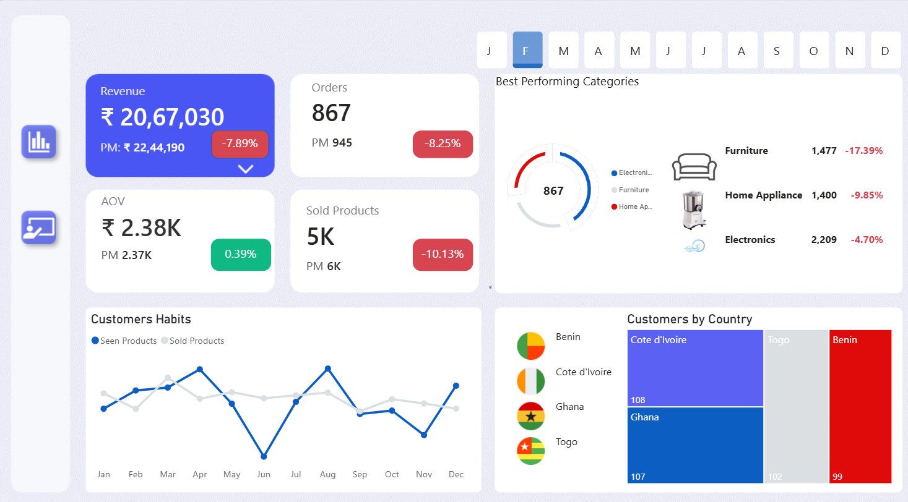
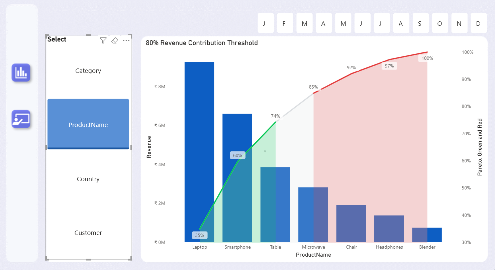
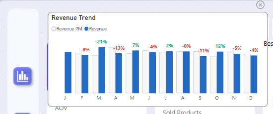

# 📊 Sales Performance Dashboard (Power BI)

## 📌 Problem Statement

Businesses often struggle to track sales performance across products, regions, and time.
This project aims to create an interactive dashboard that provides clear insights into revenue trends, product performance, and customer behavior to support data-driven decision-making.

---

## 📂 Dataset

* Sales dataset containing product, customer, country, and transaction details
* Includes metrics like revenue, orders, quantity sold, and time-based data
* Dataset size: 10,000+ records

---

## 🛠️ Tools & Technologies

* Power BI
* DAX (Data Analysis Expressions)
* Data Cleaning & Transformation

---

## 📊 Dashboard Features

* KPI Cards:

  * Revenue with month-over-month comparison
  * Total Orders
  * Average Order Value (AOV)
  * Total Products Sold

* Interactive Filters:

  * Month-wise slicer
  * Category, Product, Country, Customer filters

* Visualizations:

  * Pareto Chart for product contribution
  * Customer purchase behavior trends
  * Category-wise performance analysis
  * Country-wise customer distribution

* Advanced Features:

  * Dynamic tooltips for detailed insights
  * Month-over-month performance comparison

---

## 📈 Key Insights

* Revenue declined by **13.4% compared to previous month**
* Electronics category shows significant drop in performance
* A small group of products contributes to the majority of revenue (Pareto principle)
* Customer purchase behavior varies across months, indicating seasonal trends

---

## 💼 Business Impact

* Helps identify **top-performing and underperforming products**
* Enables **data-driven sales strategy decisions**
* Supports **inventory and pricing optimization**
* Improves understanding of **customer behavior and trends**

---

## 📸 Dashboard Preview

---

## 📁 Files in Repository

* `sales_dashboard.pbix` → Power BI dashboard file
* `dashboard_overview.png` → Main dashboard view
* `performance_chart.png` → Pareto analysis
* `tooltip_view.png` → Detailed tooltip insights

---

## 🚀 Future Improvements

* Add sales forecasting using time series models
* Integrate real-time data sources
* Enhance dashboard with advanced KPIs and drill-through analysis
